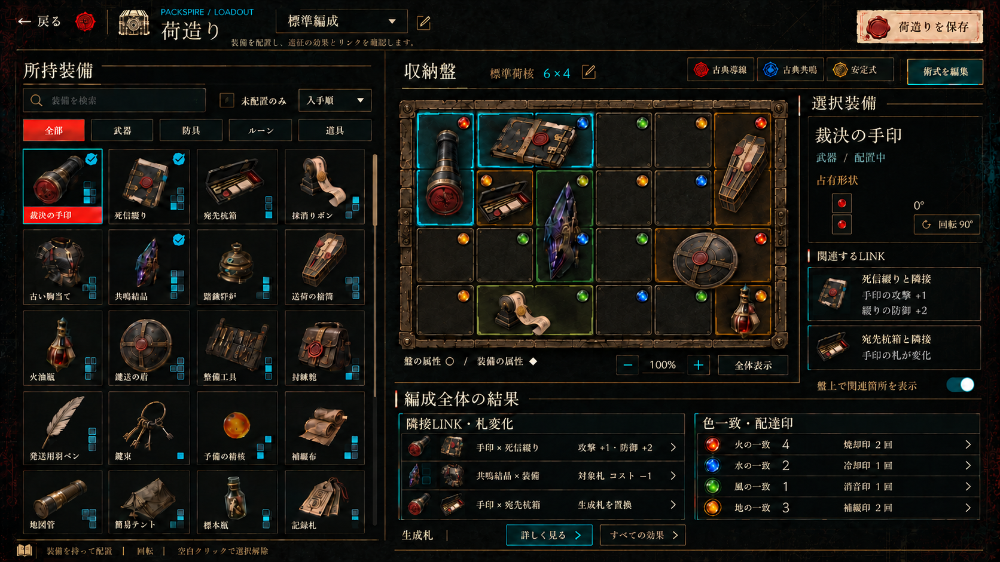
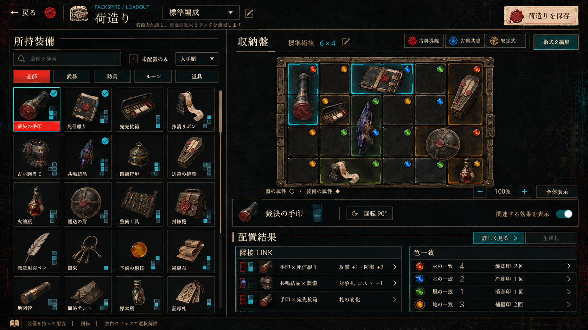
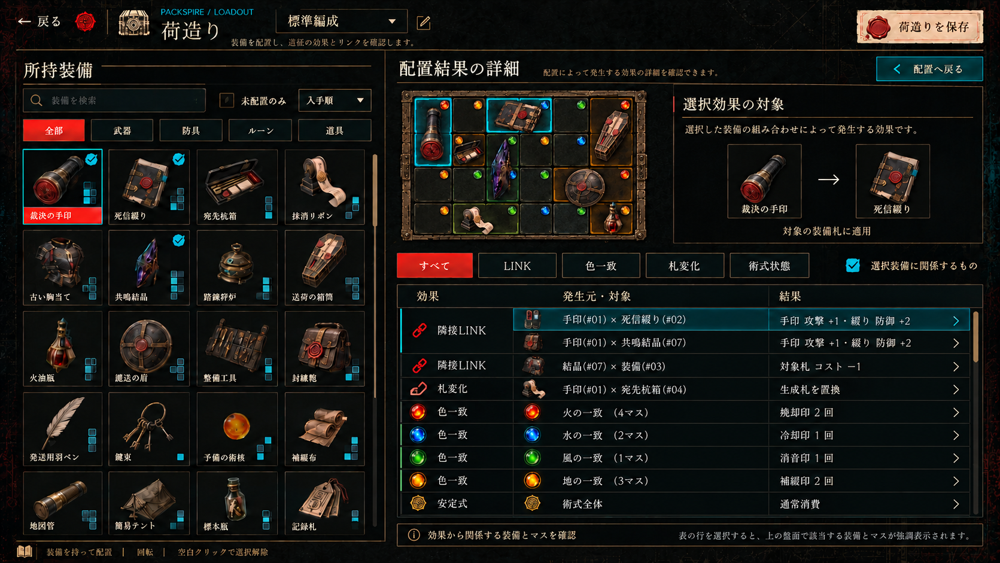

# 荷造り — PC向けの配置ワークスペース

状態: 2026-10-03にユーザー了承の下＋右構図を実装。効果・LINKを独立スクロール化。ゲームルールの変更なし。
実装正本の素材対応・寸法・実画面・検証結果は[荷造り仕様](../../specs/packing.md)を参照。
以下は構図検討時の記録。未実装・未検証・missingの表記や候補数値は当時の状態であり、現状の実装仕様ではない。
旧 packing.md / packing-selected.png は rejected。人物を荷造りへ紐付けない。

## 最新のユーザー確認（2026-10-03）

- 4枚目の効果詳細案はマスが小さすぎるため、その盤縮小レイアウトは不採用。
- それ以外の基本方向は「まあいい」。全画像の数値・仮素材・未定義の内容を承認されたとは扱わない。
- デッドスペースを減らし、結果を下だけに限定せず右も使う配分は任された。
- **優先順位は盤の可読性、所持装備一覧の容量、効果の因果確認、余白の有効利用。** 欄を増やすためにマスを縮めない。

盤の右は選択装備・関連LINK・移動時の成立／消失の差分。下は編成全体のLINK・色一致・生成札概要にする。
右欄は使える幅がある場合だけ設け、盤が大きい時は畳んで盤へ面積を返す。一覧まで狭めない。
詳細閲覧のために盤をサムネイルへ縮小する方式は廃止。詳細行は右／下の領域内で展開・スクロールし、必要なら専用閲覧へ切り替えるが、小さい盤を操作対象として残さない。
右を埋めるための人物・装備絵の大きな再掲・装飾の追加は禁止。

## 参考画像

### 最新: 下＋右に分けた構図

ユーザー指定の配分を反映する構図候補。通常時のマスを縮めず、盤を左へ寄せて右の空き幅を選択対象へ使用した。
一覧は4列のまま、右は選択装備の名前・2マス形状・回転・関連する相手と効果、下は編成全体のLINK／札変化と色一致／配達印。
右上に生成された不要な装備絵の重複は局所編集で除去した。人物・役職データは追加していない。

生成指示: [packing-context-prompt.md](packing-context-prompt.md)。内蔵imagegen使用。
参照元の実ホームと比較し、炭黒・生成り・鈍い真鍮、選択だけ朱＋水色、透過オブジェクトという基準を維持。
図は6列4行。生成のセル寸法には微差があり、正確な正方形は実装で同一のセル寸法から算出する。印の数値は構図用の例で、このイラストの全配置を実計算した値ではない。
画面・操作・ゲームルールは未変更。素材準備、多件数、可変盤、ドラッグ当たり判定のUnity検証は未実施。

### 初期: 下のみの構図（比較用）

通常時の初期構図（盤6×4、一覧4列、LINKと色一致の同時概要）:

生成指示: [packing-workspace-prompt.md](packing-workspace-prompt.md)。内蔵imagegenを使用。
最初の生成は盤の列数・行数・セル縦横比が不適切だったため不採用。盤領域のみ訂正した画像を保存。
文字や装備形状の細部は生成の近似であり、現行データを置き換える仕様書ではない。図中に増えた装備名を新しいマスタとして採用しない。

効果の詳細確認案（**盤縮小レイアウトはrejected**。行構造のみ参考として保存）:

分類・発生元・対象・結果の行構造を示す。画面例の全行が現行計算の正確な出力ではない。特に展開子行の「手印×結晶」は手印×綴りの効果を受けないので、実データに基づく正しい組へ置き換える必要がある。選択装備フィルタと全体色一致の表示状態も実装時に分離する。構図の参考のみで、数値・成立条件の承認候補ではない。

可変盤の最初の生成（exec-74c7de3d）はマス数誤りと未定義効果の追加によりrejected。保存・実装基準にはしない。
空盤に限定した訂正生成（exec-fc2eb3cc）もラベル8×6に対し描画8×5のためrejected。可変盤の正確な寸法資料として使わない。これ以上の全画面生成反復は行わず、可変盤の寸法・セル数・配置判定は定義データと実画面の検証を基準にする。通常画面を方向の参考にし、効果詳細画像は表の情報整理だけに限定する。

## 前提の確認

- PC専用。マウス、キーボード、ホバー、スクロールを利用する。スマホ／コンソール対応は今回の制約に含めない。
- 現行PanelSettingsは1280×720論理座標。密度はPC向けでも文字を無制限に小さくしない。
- 収納核にはwidth/height/属性配列/回転制限がある。現行マスタの5核はいずれも6×4だが、処理は幅・高さを参照する。可変寸法は表示上考慮し、新しい盤サイズの追加は別承認。
- 非矩形の盤・欠損マス・個別に使えないマスの判定は現行StorageCoreDefにはない。見た目だけでその機能を実装済みと見せない。将来採用するならデータ・配置判定を含むルール変更として確認する。
- 術式は収納核／属性導線／共鳴式／安定式の4部品。色配列、回転制限、共鳴条件、安定状態を分けて伝える。
- BackpackSystem.Buildの現行経路では色一致→配達印、隣接LINK→装備由来札の補正・置換。旧導線ボーナスやColorTrait定義は存在するが、Buildからは呼ばれていない。説明文だけを根拠に旧色特性効果を有効表示しない。
- 装備由来の札と役職由来の基本札は別リスト。荷造り結果は前者を表示する。人物・役職由来の印や札は、人物を選ぶ画面／出発確認側の役割。

根拠: StorageFormulaModels.cs、StorageFormulaSystem.cs、BackpackSystem.cs、LoadoutSystem.cs、DeliverySealSystem.cs、ItemContent.asset、PreparationScreens*.cs。プログラム・マスタは変更しない。

## 情報配置

広い一覧＋盤作業域を基本の二列にする。作業域内の余った右幅を選択装備・関連効果へ使い、下には編成全体の結果を置く。
右欄を固定必須の第三列にせず、可変盤の可読サイズを優先する。人物、大きな装備再掲画像、巨大な術式説明を常設しない。

| 領域 | 表示と操作 |
|---|---|
| 左・所持装備 | 幅約1/3。4列の密な一覧、検索、種別、未配置、並び順。画像・短名・占有形状・配置中状態。同名個体を勝手に一個へまとめない |
| 右上・盤 | 正方形セル。盤だけにズーム／移動／全体表示。収納核ごとの寸法と色配列を描画。外周も盤の寸法へ追従 |
| 盤直下・操作文脈 | 選択名、形、現在の向き、許可された回転、関連効果の絞り込み。装備詳細の長文は要求時に開く |
| 盤の右・選択対象 | 選択装備の短い情報、関連効果と対象、移動による成立／消失の差分。盤の表示面積が不足する時は畳む |
| 下・配置結果 | 編成全体のLINKと色一致を同時に要約表示。札の補正・置換と印の回数を混ぜない。詳細展開と生成札一覧の入口 |
| ヘッダー | 荷造り名／切替／編集、保存。キャラ選択なし |

下＋右案の論理/物理目安（実装時の収まり検証の開始点。生成画像を計測せずに写す値ではない）:

| 領域 | 1280×720論理 | 1920×1080物理 |
|---|---|---|
| 一覧（操作帯込み） | x24 y84 w452 h600 | x36 y126 w678 h900 |
| 盤表示域 | x500 y124 w506 h350 | x750 y186 w759 h525 |
| 右の選択文脈 | x1022 y124 w234 h378 | x1533 y186 w351 h567 |
| 盤のビュー操作 | x500 y482 w506 h32 | x750 y723 w759 h48 |
| 下の全体結果 | x500 y532 w756 h150 | x750 y798 w1134 h225 |

標準盤は1セル76論理pxを開始点にすれば、6×4の内部領域456×304、16pxの外周込み488×336となり、盤表示域に収まる。正方形を維持し、部品の余白で縦横を伸ばさない。
大きい盤では右欄を閉じた幅756を使い、盤表示域の高さを416程度へ拡張、下は100程度の概要にするなど、マスを縮める前に領域配分を変える。これは表示検証の目安で、新しい盤・容量の採用ではない。

4列は最低限の開始案。PCのウィンドウ幅とUI倍率を実測し、余裕がある時だけ一覧の列数・見える行数を増やす。物理ピクセルをUSSへ直書きしない。

## 盤の表現とカスタマイズ

- マスの属性宝石は維持する。単なる色付きタイルへ置換しない。
- 盤側の属性＝丸い宝石の座、装備側の属性＝占有マス端の小さい菱形。未選択でも属性を判別でき、色覚に依存しすぎない形・記号を添える。
- 盤ベース／正方形セル／属性宝石／装備の占有形状／一枚の装備絵／状態の強調を分離する。装備画像を各マスへ反復しない。
- 収納核の変更では盤の寸法・色配列・回転制限を反映。外周は伸縮部品＋角部品などで対応し、一枚の固定盤画像を縦横に伸ばさない。
- 核固有の材質・外周形状は専用素材を用意してから表示する。現行マスタの核artworkは未指定であり、全核の固有表現が既にあるとは扱わない。
- 導線・共鳴・安定は盤ヘッダーに選択中の部品と状態を表示。彫刻・小型差込部品で視覚にも反映する案だが、飾り線を実際のLINKと誤認させない。
- 色配列を盤上で編集できるとは約束しない。現在の選択単位は核／術式部品。個別セル編集を追加する場合は別ルール確認。
- 盤が大きくなっても一覧・効果の領域を侵食しない。自動フィットで読みづらくなる場合、盤だけ拡大・移動できる。手動倍率を自動更新で戻さない。初期の可読下限は実キャプチャで決める。
- 盤の可読下限は64論理px前後を実測の開始点とし、確定値とは扱わない。標準盤では通常画像程度の大きさを確保する。詳細表示時にも勝手に縮めない。大きい盤では右の補助欄を先に畳み、下を概要に整理し、それでも収まらなければ盤だけ移動して操作する。自動縮小ですべてを詰め込まない。
- ドラッグの占有形状、当たり判定、盤描画は同じ座標変換を使う。拡大・移動・回転後もマスとドロップ先を一致させる。

## 効果が増えることへの対応

一効果一巨大カードではなく、概要＋詳細の二段階。効果そのものは省略・合算して消さない。

- 概要: LINKの成立種別・成立箇所数、4属性の一致数と実際に得られる印、装備由来札の入口。複数カテゴリを同時に確認できる。
- 詳細: 効果名／対象装備・対象札／成立条件／結果／状態を行として表示。分類はLINK、色一致、札変化、術式状態。右／下で必要時に展開し、一覧部分だけをスクロールする。盤を縮小した効果詳細モードは採用しない。
- 同じルールが複数箇所で成立する時は折りたたみ行＋成立箇所。単なる名称重複排除で複数適用を隠さない。
- ホバー: 関係する装備・境界・色一致マスを一時的に強調。クリック: 詳細を固定。単なる装備間の線を常時全て描かない。
- 選択装備フィルタは明示状態にする。選択しただけで全体結果が消えて編成全体を確認できなくなる挙動を避ける。
- 移動候補では成立／消失／変化を差分表示。現行結果と混ぜない。無効な置き場所では「配置不能」を優先し、仮の成立を確定結果に見せない。
- 色一致には一致マスと、そこから生じる印を別欄で表示。全体攻撃+Xのような誤った合算値は出さない。
- 未成立の候補は別フィルタ。現在の発動中効果を押し流さない。
- 元データが効果名の文字列だけでは、対象と成立箇所を正確に追跡できない。将来の表示実装ではinstance UID／rule ID／対象札／座標の構造化結果が必要。効果計算のルールを変えるのでなく、根拠を保持して表示する。

## PC操作

一覧ホイールは一覧だけ、盤のビュー操作は盤だけ、効果ホイールは効果だけ。各領域でクリップと入力を分離。
検索へフォーカスした時は文字入力を優先し、ゲーム操作キーを誤発火させない。
長い装備名・詳細はホバーで読めるが、重要な数値はホバー必須にしない。
ドラッグ中も占有形状と配置可否が見える。空白クリックで解除し、検索・フィルタ・効果・保存ボタンを空白扱いしない。
回転操作は核の回転制限に従う。新しいキー割当は既存の割当との競合を確認してから決める。

## 素材対応（実装開始ゲートでは未準備あり）

| 部品 | 種別／候補 | 状態 |
|---|---|---|
| 炭黒の画面・文字・選択紙 | ホーム共通の背景・完成部品。通常罫線はUSS | 既存、画面との一致確認が必要 |
| 一覧装備 | 現行装備オブジェクト絵。透過サムネイル＋動的文字・形 | 既存、境界・解像度確認が必要 |
| 属性宝石 | Art/Rite/orb-*既存アイコン | 既存、盤上での寸法・明度確認が必要 |
| 可変盤の外周と核別の材質 | 伸縮枠・角・背景。盤全体の完成画像ではない | missing |
| 占有下地と選択境界 | 形に従う状態部品 | missing |
| 導線／共鳴／安定の盤用差込部品 | 装飾と状態アイコンを分離 | missing |
| 結果一覧 | UXML領域＋動的行＋画面USS。未準備の装飾は追加しない | 未実装 |

盤の属性宝石は専用系統を使い、他領域へ宝石枠・過剰発光を転用しない。完成部品の重ね貼りや生成モックの文字入り切り出しは禁止。

## 検証予定（まだ実行していない）

1. シェル→一覧→盤→結果→操作状態を一領域ずつUnityで撮影・比較。
2. 所持0/1/20/100/500個、同名個体・長名・検索0件。100/500はUI負荷テスト用でゲーム上限ではない。
3. 標準盤、横長、縦長、拡大・縮小、ウィンドウ変更。仮寸法は表示テストであり新しい核の採用ではない。
   右欄が出た時・詳細を開いた時にマスが小さくならないこと、右欄を畳んだ時に手動ズーム・ドラッグ座標が変わらないことも確認する。
4. LINK0/複数/多数、同ルール複数成立、色一致0/4属性、複数札変化、術式状態、選択装備だけの表示。
5. 各ズームでクリック・ドラッグ・回転・リストから盤への移動。空白解除とスクロールが保存／効果操作を妨げないこと。
6. 計算差分プレビューがセーブ・配置・選択札を勝手に変更しないこと。
7. missing素材の準備とホームとの比較を通してから画面実装を開始する。

参考画像は構図用。図中の装備追加、件数、盤サイズ、数値は新ルールの採用を意味しない。操作の実動と多件数負荷は未検証。
