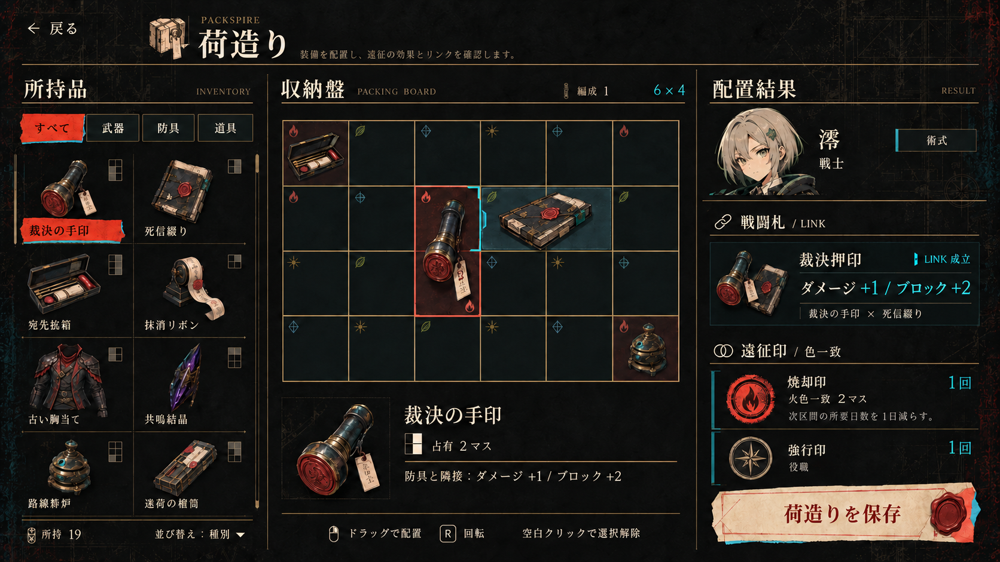

# 01 荷造り — 配置と結果を一画面で読む

状態: **rejected（ユーザー指摘により却下）**。未実装。実装基準にしない。
後継案は [packing-workspace.md](packing-workspace.md)。

却下理由: 固定6×4・少数効果を前提にし、装備一覧が狭い。盤のカスタマイズと可変寸法を扱えていない。独立して選ぶ人物を編成結果へ混入した。以下は履歴としてのみ保存する。
対象: 現行6×4収納盤、所持品一覧、配置結果、既存術式選択の入口。

生成指示: [packing-prompt.md](packing-prompt.md)。選択状態の構図を示す参考画像であり、実装素材として切り出さない。

## 解決する問題

1. 多マス装備の画像がセルごとに反復され、一つの装備と占有領域の関係が弱い。
2. 色一致、隣接LINK、戦闘札、遠征印が同じような情報として並び、配置の成果が読みにくい。
3. 重い一覧枠、魔方陣系の旧素材、別系統の画像が主役の盤面と競合する。
4. 装備形状と配置可否が持ち上げ時に把握しにくい。

## 具体的な変更

- 盤は正方形セルを維持し、複数セル装備は占有形状の下地＋一枚の透過オブジェクト絵で表示する。
- 一覧は2列のオブジェクト・名前・小型占有形状。通常状態の大きな装飾カード枠を廃し、選択名へ朱紙を使う。
- ドラッグ中は装備絵と回転後の全占有形状、置ける／置けない状態を同時表示。配置不能は色だけでなく×形で示す。
- 選択時だけ隣接境界と色一致セルを強調。装備と無関係な盤面全体は発光させない。
- 盤の下は選択装備・占有・LINK条件。右は配達人を小さく残し、戦闘札の変化と遠征印を別セクションにする。
- 本文は常時読める。選択・移動で変わった行だけ短く強調し、手動で別画面を開かなくても変更が分かる。
- 未選択時は右欄へ編成全体の有効LINKと遠征印を出し、装備選択時は関係する行を優先・強調する。従来の戦闘札一覧へのアクセスはこの見出しから残す。
- 術式は右上の小型タブ。詳細選択は明示クリックで開き、ホバーだけで盤を覆わない。
- 一覧だけをスクロール。保存操作は右下に固定。空白クリックで選択解除し、解除用ボタンは置かない。

## 変えないゲーム仕様

- 色一致は遠征印、隣接LINKは戦闘札の効果を担当する。
- 配置装備から戦闘札を構築する規則、容量、回転能力、印の回数計算を変えない。
- 現行の6×4を標準表示するが、別術式の盤寸法はデータから取得する。
- 旧参考資料の7×7、配送依頼、専用荷室、出発時の新たな封印規則は復活させない。
- 図中の配置・値・色配列は構成の表示例。実装時は現行core.board、BackpackSystem.Build、DeliverySealSystemの出力を表示し、未成立効果を示さない。参考画像の配列へゲームデータを合わせて変更しない。

## 論理座標案

基準1280×720。物理撮影1920×1080は全値を1.5倍へ換算する。

| 領域 | 論理座標 | 物理撮影座標 |
|---|---|---|
| ヘッダー | x24 y20 w1232 h60 | x36 y30 w1848 h90 |
| 所持品 | x24 y100 w266 h584 | x36 y150 w399 h876 |
| 盤面領域 | x314 y100 w584 h584 | x471 y150 w876 h876 |
| 標準6×4盤 | x328 y164 w552 h368、セル92角 | x492 y246 w828 h552、セル138角 |
| 選択装備情報 | x328 y554 w552 h72 | x492 y831 w828 h108 |
| 結果欄 | x922 y100 w334 h516 | x1383 y150 w501 h774 |
| 保存操作 | x922 y634 w334 h50 | x1383 y951 w501 h75 |

## 素材対応・実装ゲート

全画面生成画像は構図案であり、以下の対応部品が揃うまで実装基準として採用しない。

| 主要部品 | 分類 | 制作元 | 状態 |
|---|---|---|---|
| 黒曜版画背景 | 背景 | ObsidianMisprintShared/misprint-background-route-v1.png | 既存、遮光と密度を再検証 |
| 朱紙・水色版ズレ | 完成部品 | ホームと同系統の選択面から専用小型部品を作成 | 新規部品未制作 |
| 所持品・盤面装備 | オブジェクト絵 | 現行装備原画。透過と盤面用表示を調整 | 混在あり、必要な派生素材は未制作 |
| セル・占有形状・接続状態 | 枠／アイコン | 共通形状＋画面用の薄いセル・境界部品 | 占有表示は既存、状態部品は未制作 |
| 澪の顔 | オブジェクト絵 | 現行ホーム人物アートから顔用の適切な領域を表示 | 原画既存、切り取り検証が必要 |
| 遠征印 | アイコン | 現行印アイコンと動的回数ラベル | 既存、画面との整合確認 |
| 結果欄 | 補助面・文字 | UXML/USS、計算済みデータ | 新しい表示構造は未実装 |
| 保存票 | 完成部品 | ホームの紙・朱印と同系統の専用票 | 新規部品未制作 |

シェル→一覧→詳細→ドラッグ・空・多件数・別盤サイズの順に実画面比較する。
所持品0/1/12件以上、LINK0/複数、長名、無効配置、保存前後で確認する。

## 確認したいこと

- 盤と一装備一画像を主役にする構図。
- 選択装備の詳細は盤の下、編成全体の結果は右へ分けること。
- 初期状態は配達人・効果が見え、術式は小型タブにすること。

この機能は見た目・操作フィードバックの改善として提案し、新しいゲームルールは含めない。

## 参考画像の確認記録

- ホームの炭黒・生成り・朱紙・水色版ズレと同系統。紫の戻る矢印、ゴシック多重枠、魔方陣はない。
- 6列4行、正方形セル。一つの手印画像が縦2マスを跨ぎ、台帳画像が横2マスを跨ぐ。
- 一覧のオブジェクトは静かな背景へ配置し、選択だけ朱紙。人物は顔の見える切り取り。
- 下部の誤ったSpaceキー表記は、一領域だけの画像編集で空白クリックへ訂正済み。
- 実画面撮影ではなく生成構図。長名・全装備・別盤サイズ・ドラッグ実動はまだ検証していない。
- 画像内の細部と値より、本書の操作契約・現行データ・1280×720の実読を優先する。
